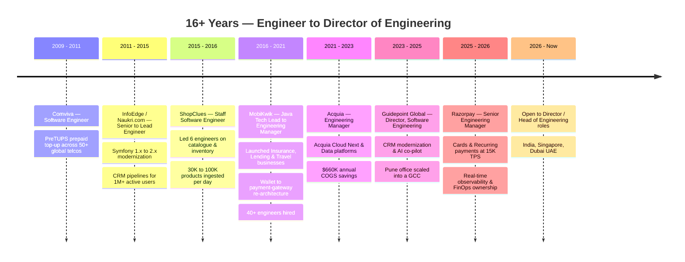
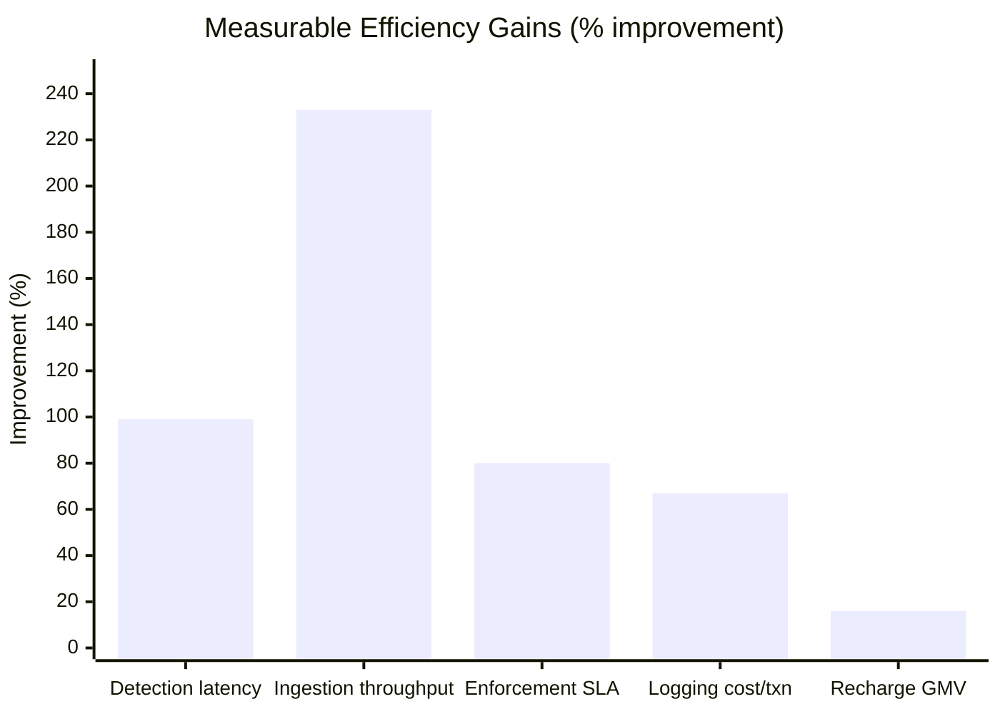
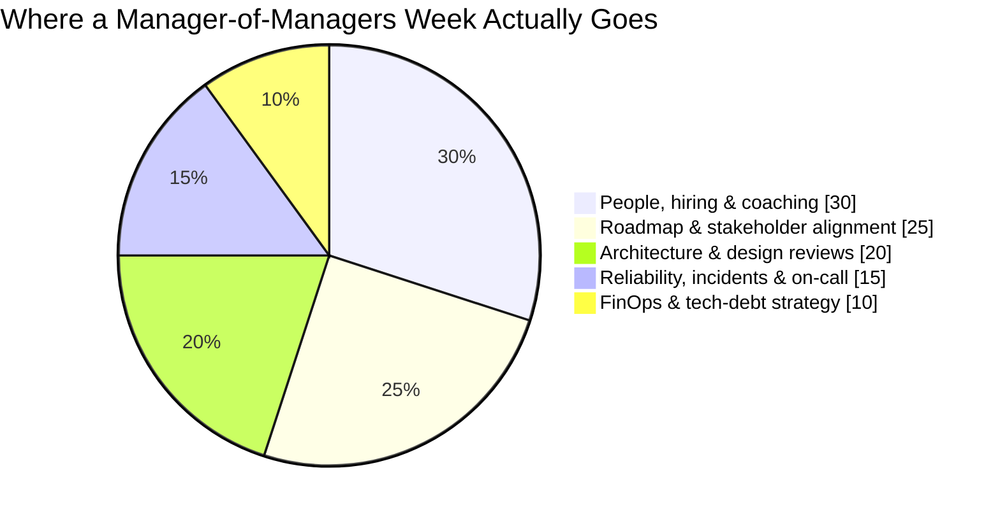
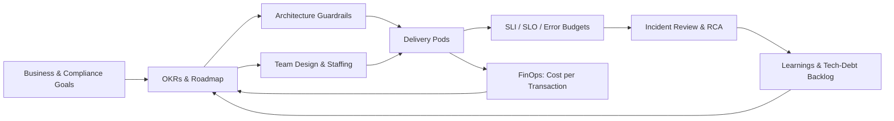
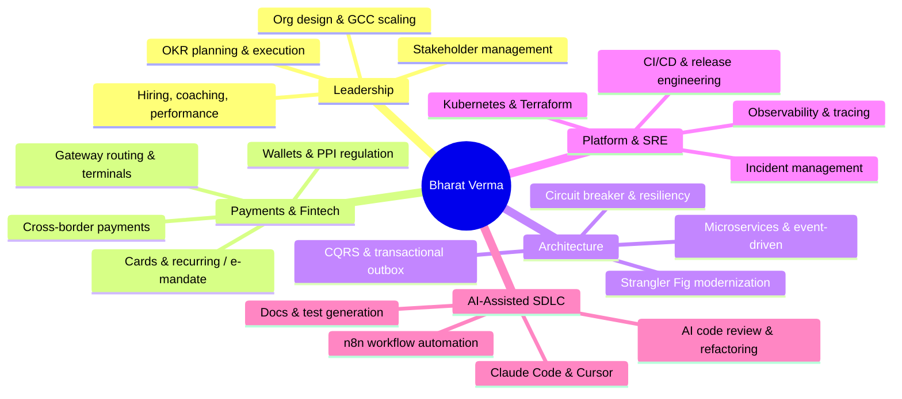
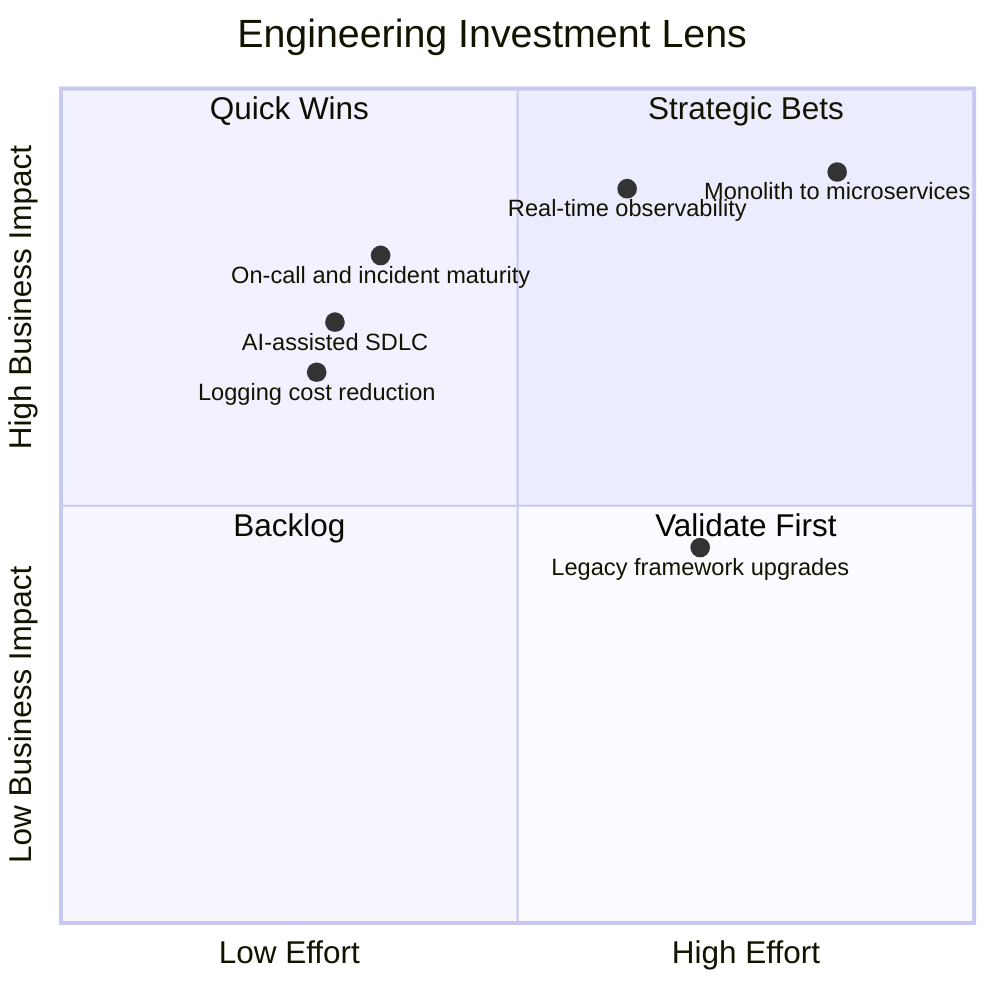

<div align="center">

# Hey there, I'm Bharat Verma 👋

[](https://git.io/typing-svg)

  [](https://linkedin.com/in/bharatverma) [](https://twitter.com/iambharatv)

[](https://linkedin.com/in/bharatverma)
[](https://linkedin.com/in/bharatverma)

</div>

---

## 🚀 About Me

```yaml
name: Bharat Verma
location: Pune, Maharashtra, India 🇮🇳
title: Director of Platform Engineering @AssetMark USA 🧭
experience: 16+ years ⏳
status: Open to engineering leadership roles 🟢
open_to_locations: [India, Singapore, Dubai / UAE] 🌍
scale_owned:
  throughput: 5K–15K TPS 💳
  daily_volume: $60M–$90M 💰
  org: 21 engineers directly, 33+ influenced 👥
domains:
  - Payments & Fintech Platforms 💳
  - Distributed & Event-Driven Systems 🌐
  - Cloud-Native Platform Engineering ☁️
  - GCC / Site Scaling & Org Design 🏗️
  - SRE, Observability & FinOps 📊
focus_areas:
  - AI-assisted SDLC (review, refactor, docs, test generation) 🤖
  - Monolith → microservices modernization (Strangler Fig) 🧩
  - Cost-per-transaction optimization & reliability engineering 📉
learning: RAG, LLM agents, MCP, n8n workflow automation 🤖
```

---

## 💼 Career Timeline



| Role                               | Company              | Period              | Scope & Scale                                |
| ---------------------------------- | -------------------- | ------------------- | -------------------------------------------- |
| **Senior Engineering Manager**     | Razorpay 💳          | Mar 2025 – Apr 2026 | 21 engineers · 3 pods · 15K TPS · $60–90M/day |
| **Director, Software Engineering** | Guidepoint Global 🌐 | Jun 2023 – Feb 2025 | CRM modernization · GCC build-out             |
| **Engineering Manager**            | Acquia ☁️            | Feb 2021 – Jun 2023 | IST + EST teams · Cloud Next migrations       |
| **Tech Lead → Engineering Manager** | MobiKwik 💰          | Nov 2016 – Feb 2021 | Built teams 0→12 · 40+ hires · 99.90% SLA     |
| **Staff Software Engineer**        | ShopClues 🛒         | Sep 2015 – Nov 2016 | 6 engineers · Catalogue & inventory platform  |
| **Senior → Lead Engineer**         | InfoEdge (Naukri) 📋 | Nov 2011 – May 2015 | Platform modernization · 1M+ users            |
| **Software Engineer**              | Comviva 📡           | Dec 2009 – Mar 2011 | PreTUPS™ · 50+ telecom deployments            |

---

## 📈 Impact Snapshot

<div align="center">

| Metric                        | Before        | After          | Where             |
| ----------------------------- | ------------- | -------------- | ----------------- |
| Merchant issue detection      | ~20 minutes   | **< 1 second** | Razorpay          |
| Logging cost per transaction  | ₹0.09         | **₹0.03**      | Razorpay          |
| Annual cloud COGS             | baseline      | **−$660K**     | Acquia            |
| Recharge GMV per month        | ₹181 Cr       | **₹210 Cr**    | MobiKwik          |
| Catalogue ingestion / day     | 30K products  | **100K**       | ShopClues         |
| Banned-product enforcement    | 5 days        | **< 24 hours** | ShopClues         |
| Ecosystem-wide PHP 8 upgrade  | —             | **2 months**   | Guidepoint Global |

</div>





---

## 🧭 Leadership Operating Model



---

## 🧠 Expertise Map



---

## 🛠️ Technology Stack

<h3 align="center">Languages</h3>
<p align="center">
  <a href="https://www.java.com" target="_blank">
    
  </a>
  <a href="https://go.dev/" target="_blank">
    
  </a>
  <a href="https://www.php.net/" target="_blank">
    
  </a>
  <a href="https://www.python.org/" target="_blank">
    
  </a>
  <a href="https://www.gnu.org/software/bash/" target="_blank">
    
  </a>
</p>

<h3 align="center">Backend & Frameworks</h3>
<p align="center">
  <a href="https://spring.io/" target="_blank">
    
  </a>
  <a href="https://hibernate.org/" target="_blank">
    
  </a>
  <a href="https://echo.labstack.com/" target="_blank">
    
  </a>
  <a href="https://symfony.com/" target="_blank">
    
  </a>
  <a href="https://api-platform.com/" target="_blank">
    
  </a>
  <a href="https://grpc.io/" target="_blank">
    
  </a>
</p>

<h3 align="center">Databases & Caching</h3>
<p align="center">
  <a href="https://www.mysql.com" target="_blank">
    
  </a>
  <a href="https://www.postgresql.org" target="_blank">
    
  </a>
  <a href="https://www.mongodb.com/" target="_blank">
    
  </a>
  <a href="https://cassandra.apache.org/" target="_blank">
    
  </a>
  <a href="https://redis.io" target="_blank">
    
  </a>
  <a href="https://www.elastic.co" target="_blank">
    
  </a>
  <a href="https://www.pingcap.com/tidb/" target="_blank">
    
  </a>
  <a href="https://aws.amazon.com/rds/aurora/" target="_blank">
    
  </a>
</p>

<h3 align="center">Streaming, Analytics & Data</h3>
<p align="center">
  <a href="https://pinot.apache.org/" target="_blank">
    
  </a>
  <a href="https://spark.apache.org/streaming/" target="_blank">
    
  </a>
  <a href="https://www.databricks.com/" target="_blank">
    
  </a>
</p>

<h3 align="center">Message Queues & Streaming</h3>
<p align="center">
  <a href="https://kafka.apache.org/" target="_blank">
    
  </a>
  <a href="https://www.rabbitmq.com/" target="_blank">
    
  </a>
  <a href="https://aws.amazon.com/sqs/" target="_blank">
    
  </a>
</p>

<h3 align="center">Cloud & Infrastructure</h3>
<p align="center">
  <a href="https://aws.amazon.com/" target="_blank">
    
  </a>
  <a href="https://azure.microsoft.com/en-us/products/kubernetes-service" target="_blank">
    
  </a>
  <a href="https://cloud.google.com/" target="_blank">
    
  </a>
  <a href="https://kubernetes.io" target="_blank">
    
  </a>
  <a href="https://www.docker.com/" target="_blank">
    
  </a>
  <a href="https://www.terraform.io/" target="_blank">
    
  </a>
</p>

<h3 align="center">DevOps & CI/CD</h3>
<p align="center">
  <a href="https://github.com/features/actions" target="_blank">
    
  </a>
  <a href="https://www.jenkins.io" target="_blank">
    
  </a>
  <a href="https://argoproj.github.io/cd/" target="_blank">
    
  </a>
  <a href="https://www.ansible.com/" target="_blank">
    
  </a>
  <a href="https://azure.microsoft.com/en-us/products/devops" target="_blank">
    
  </a>
  <a href="https://git-scm.com/" target="_blank">
    
  </a>
</p>

<h3 align="center">Observability & Monitoring</h3>
<p align="center">
  <a href="https://www.datadoghq.com/" target="_blank">
    
  </a>
  <a href="https://grafana.com/" target="_blank">
    
  </a>
  <a href="https://prometheus.io/" target="_blank">
    
  </a>
  <a href="https://opentelemetry.io/" target="_blank">
    
  </a>
  <a href="https://www.elastic.co/elastic-stack" target="_blank">
    
  </a>
  <a href="https://www.pagerduty.com/" target="_blank">
    
  </a>
  <a href="https://www.cloudzero.com/" target="_blank">
    
  </a>
</p>

<h3 align="center">AI-Assisted Engineering</h3>
<p align="center">
  <a href="https://www.anthropic.com/claude-code" target="_blank">
    
  </a>
  <a href="https://cursor.com/" target="_blank">
    
  </a>
  <a href="https://github.com/features/copilot" target="_blank">
    
  </a>
  <a href="https://chatgpt.com/" target="_blank">
    
  </a>
  <a href="https://n8n.io/" target="_blank">
    
  </a>
</p>

---

## 🎯 Leadership Focus Areas

<div align="center">

|       👥 People        |    🏗️ Architecture     |      📈 Delivery      |        💸 Efficiency        |
| :--------------------: | :-----------------------: | :-------------------: | :-------------------------: |
|     Team Building      |  Microservices & Events   |   SLI / SLO / SLA     |  FinOps & Cost per Txn      |
|   Hiring & Mentoring   |   Cloud-Native Platforms  |  Incident Management  |  Tech-Debt Roadmaps         |
| Performance Management |  Reliability & Resiliency |   CI/CD Excellence    |  Vendor & Cloud Spend       |
| Org Design & GCC Scale |   Payments & Compliance   |  On-Call Readiness    |  AI-Assisted SDLC           |

</div>



---

## 🎓 Education

**B.Tech, Computer Engineering** — Jamia Millia Islamia, New Delhi (Jul 2005 – Jun 2009)

---

## 🟢 Open to Opportunities

I'm currently exploring **Director of Engineering / Head of Engineering / Senior Engineering Manager** roles in
**India 🇮🇳 · Singapore 🇸🇬 · Dubai / UAE 🇦🇪**, especially in payments, fintech, SaaS, or platform engineering —
including GCC build-out and site-leadership mandates.

📧 **bindian0509@gmail.com** · 🔗 [linkedin.com/in/bharatverma](https://linkedin.com/in/bharatverma)

---

## 🤝 Let's Connect

<div align="center">

<a href="https://linkedin.com/in/bharatverma" target="_blank">
  
</a>
<a href="https://twitter.com/iambharatv" target="_blank">
  
</a>
<a href="https://dev.to/bindian0509" target="_blank">
  
</a>
<a href="https://bharatv90s.medium.com/" target="_blank">
  
</a>
<a href="https://bharatv.hashnode.dev/" target="_blank">
  
</a>

<br/>

<a href="https://leetcode.com/bindian0509/" target="_blank">
  
</a>
<a href="https://stackoverflow.com/users/723817/bharat" target="_blank">
  
</a>
<a href="https://github.com/bindian0509" target="_blank">
  
</a>
<a href="https://gitlab.com/bindian0509" target="_blank">
  
</a>

</div>

---

## 📬 Reach Me

<div align="center">

<a href="mailto:bharatv@outlook.in?subject=Hello%20from%20GitHub&body=Hi%20Bharat," target="_blank">
  
</a>
<a href="https://t.me/BIRD_PERSON_27" target="_blank">
  
</a>
<a href="https://linktr.ee/bharatv" target="_blank">
  
</a>

</div>

---

## 📊 GitHub Stats

<div align="center">

<a href="https://github.com/bindian0509">
  
</a>

<br/>

<a href="https://github.com/bindian0509">
  
</a>
<a href="https://github.com/bindian0509">
  
</a>

<br/>

<a href="https://github.com/bindian0509">
  
</a>
<a href="https://github.com/bindian0509">
  
</a>

<br/>

<a href="https://github.com/bindian0509">
  
</a>
<a href="https://github.com/bindian0509">
  
</a>

<br/>

<a href="https://github.com/bindian0509">
  
</a>

<br/>

<a href="https://github.com/bindian0509">
  
</a>

<br/>

<a href="https://github.com/bindian0509">
  
</a>

</div>

---

## 💬 Ask Me About (Also for Interview Preparation Help)

- **System Design** → Distributed systems, event-driven architecture, high-scale platforms
- **Payment Systems** → Cards, recurring & e-mandate, routing, wallets, PPI/RBI compliance
- **Engineering Leadership** → Org design, hiring, coaching, performance, manager-of-managers
- **Platform Modernization** → Strangler Fig, monolith decomposition, framework upgrades
- **SRE & FinOps** → SLO design, incident management, observability, cost per transaction
- **AI-Assisted SDLC** → AI code review, refactoring, docs & test generation at team scale
- **GCC & Site Scaling** → Standing up India engineering centers for global companies

---

<div align="center">

### 🌟 _"Building reliable payment platforms at scale — and the teams that keep them reliable."_

<br/>


**⭐ Star my repos if you find them useful!**

</div>

---

<div align="center">
  <sub>Last updated: July 2026 | Pune, Maharashtra, India 🇮🇳</sub>
</div>
